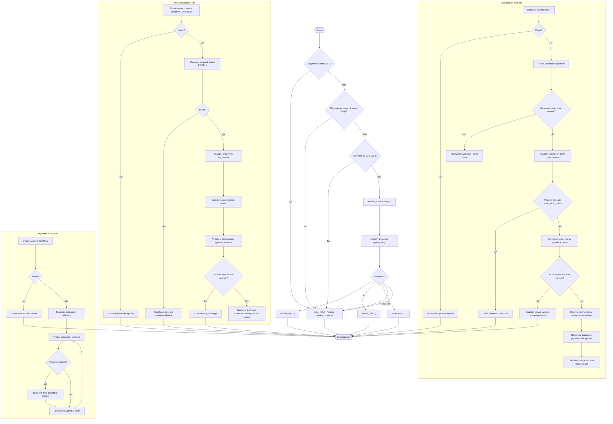

# Архиватор DefOS

Примитивный архиватор для операционной системы, реализованный на языке C с использованием системных вызовов Unix.

## Описание

Архиватор позволяет создавать архивы файлов без сжатия, сохраняя все атрибуты файлов (права доступа, время модификации, владелец). Поддерживает добавление файлов в архив, извлечение с удалением из архива и просмотр содержимого.

## Возможности

- ✅ Добавление файлов в архив
- ✅ Извлечение файлов из архива (с удалением из архива)
- ✅ Просмотр содержимого архива
- ✅ Сохранение всех атрибутов файлов
- ✅ Обработка ошибок и граничных случаев
- ✅ Поддержка файлов до 1GB
- ✅ Буферизованное чтение/запись для производительности

## Требования

- Операционная система: Linux/macOS/Unix
- Компилятор: GCC
- Права доступа: стандартные пользовательские права

## Компиляция

```bash
# Сборка архиватора
make

# Очистка временных файлов
make clean
```

## Использование

### Синтаксис

```bash
./archiver <имя_архива> [ключ] [файл]
```

### Ключи командной строки

| Ключ | Длинный вариант | Описание | Аргумент |
|------|----------------|----------|----------|
| `-i` | `--input` | Добавить файл в архив | Имя файла |
| `-e` | `--extract` | Извлечь файл из архива | Имя файла |
| `-s` | `--stat` | Показать содержимое архива | Нет |
| `-h` | `--help` | Показать справку | Нет |

## Примеры использования

### 1. Создание архива и добавление файлов

```bash
# Добавить один файл в архив
./archiver my_archive -i document.txt

# Добавить несколько файлов в один архив
./archiver my_archive -i file1.txt
./archiver my_archive -i file2.txt
./archiver my_archive -i image.jpg
```

### 2. Просмотр содержимого архива

```bash
# Показать все файлы в архиве
./archiver my_archive -s
```

**Пример вывода:**
```
Содержимое архива 'my_archive':
--------------------------------------------------
Имя файла              Размер (B) Время модификации
--------------------------------------------------
document.txt                  1024        2025-10-12 15:30:45
file1.txt                     512         2025-10-12 15:31:02
file2.txt                     256         2025-10-12 15:31:15
image.jpg                     2048        2025-10-12 15:31:30
```

### 3. Извлечение файлов из архива

```bash
# Извлечь файл из архива (файл будет удален из архива)
./archiver my_archive -e document.txt
```

**После извлечения файл:**
- Восстанавливается в текущей директории
- Сохраняет все атрибуты (права доступа, время модификации)
- Помечается как удаленный в архиве
- Не отображается при просмотре архива

### 4. Получение справки

```bash
# Показать справку по использованию
./archiver --help
```

## Структура архива

Архив представляет собой бинарный файл со следующей структурой:

```
[Заголовок_файла_1][Данные_файла_1][Заголовок_файла_2][Данные_файла_2]...
```

### Структура заголовка файла

```c
struct file_header {
    char name[256];        // Имя файла (максимум 255 символов)
    struct stat metadata;  // Метаданные файла (размер, права, время)
    char is_deleted;       // Флаг удаления (0 = активен, 1 = удален)
};
```

## Ограничения

### Размеры файлов
- Максимальный размер файла: 1 GB
- Максимальная длина имени файла: 255 символов

### Типы файлов
- Поддерживаются обычные файлы
- Символические ссылки обрабатываются как обычные файлы
- Специальные файлы (устройства) могут работать некорректно

### Права доступа
- Изменение владельца файла (chown) требует root-прав
- Восстановление прав доступа работает в пределах возможностей пользователя

## Обработка ошибок

Архиватор обрабатывает следующие типы ошибок:

### Ошибки файловой системы
- Файл не найден
- Недостаточно прав доступа
- Диск заполнен
- Сетевые ошибки

### Ошибки архива
- Архив поврежден
- Неверный формат заголовка
- Ошибки позиционирования

### Ошибки памяти
- Недостаточно памяти для обработки файла
- Ошибки выделения буферов

### Примеры сообщений об ошибках

```bash
# Файл не найден
Не удалось открыть входной файл: No such file or directory

# Недостаточно прав
Не удалось создать файл для извлечения: Permission denied

# Архив не существует
Не удалось открыть архив: No such file or directory

# Слишком большой файл
Файл 'large_file.bin' слишком большой для извлечения (размер: 2147483648 байт)

# Файл не найден в архиве
Файл 'nonexistent.txt' не найден в архиве.
```

## Безопасность

### Защита от переполнения
- Проверка размера файлов перед обработкой
- Буферизованное чтение для больших файлов
- Ограничения на длину имен файлов

### Обработка поврежденных архивов
- Проверка целостности заголовков
- Корректная обработка ошибок чтения
- Защита от бесконечных циклов

## Производительность

### Оптимизации
- Буферизованное чтение/запись (4KB блоки)
- Минимальное использование памяти
- Эффективное позиционирование в файле

### Рекомендации
- Для файлов > 100MB используйте SSD
- Избегайте архивирования множества мелких файлов
- Регулярно проверяйте целостность архивов

## Примеры сценариев использования

### 1. Резервное копирование документов

```bash
# Создать архив с документами
./archiver backup_2025-10-12 -i ~/Documents/report.pdf
./archiver backup_2025-10-12 -i ~/Documents/presentation.pptx
./archiver backup_2025-10-12 -i ~/Documents/spreadsheet.xlsx

# Проверить содержимое
./archiver backup_2025-10-12 -s

# Извлечь нужный файл
./archiver backup_2025-10-12 -e report.pdf
```

### 2. Передача файлов

```bash
# Упаковать файлы для передачи
./archiver transfer_package -i source_code.c
./archiver transfer_package -i README.md
./archiver transfer_package -i config.ini

# На целевой системе извлечь
./archiver transfer_package -e source_code.c
./archiver transfer_package -e README.md
./archiver transfer_package -e config.ini
```

### 3. Архивирование логов

```bash
# Добавить лог-файлы в архив
./archiver logs_archive -i /var/log/app.log
./archiver logs_archive -i /var/log/error.log
./archiver logs_archive -i /var/log/access.log

# Просмотреть архив
./archiver logs_archive -s
```

## Отладка и диагностика

### Проверка целостности архива
```bash
# Просмотр содержимого для проверки
./archiver archive_name -s

# Попытка извлечения файла
./archiver archive_name -e test_file.txt
```

### Анализ размера архива
```bash
# Посмотреть размер архива
ls -lh archive_name

# Сравнить с исходными файлами
du -sh original_files/
```

## Совместимость

### Операционные системы
- ✅ Linux (Ubuntu, CentOS, Debian, etc.)
- ✅ macOS (10.10+)
- ✅ FreeBSD
- ✅ OpenBSD
- ❌ Windows (требует WSL или Cygwin)

### Архитектуры
- ✅ x86_64
- ✅ x86
- ✅ ARM64
- ✅ ARM

## Разработка

### Структура проекта
```
lab5/
├── main.c          # Исходный код архиватора
├── Makefile        # Файл сборки
├── README.md       # Документация (этот файл)
├── tz.txt          # Техническое задание
└── archiver        # Скомпилированный исполняемый файл
```

### Компиляция с отладкой
```bash
# Сборка с отладочной информацией
gcc -Wall -Wextra -g -o archiver main.c

# Запуск под отладчиком
gdb ./archiver
```

### Тестирование
```bash
# Создать тестовые файлы
echo "Test content" > test1.txt
echo "Another test" > test2.txt

# Протестировать архиватор
./archiver test_archive -i test1.txt
./archiver test_archive -i test2.txt
./archiver test_archive -s
./archiver test_archive -e test1.txt
```
### Блок-схема алгоритма архиватора



```
